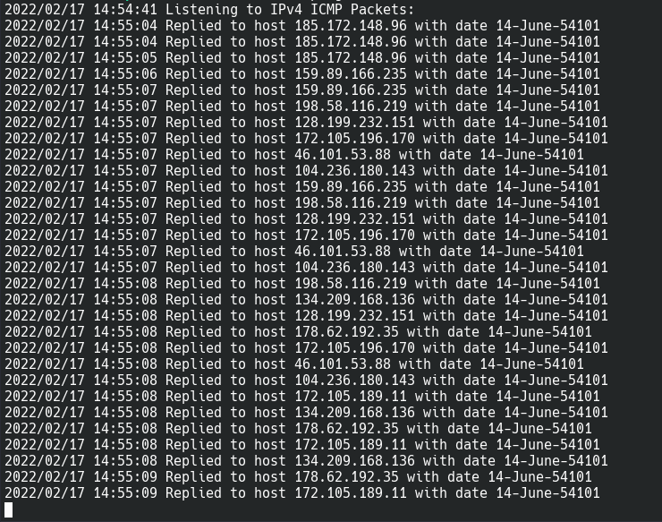

<div align="left" id = "top">
<h1>Pongo</h1>
<h3>Get message from future instantly using icmp ping</h3> 
</div>

## Contents
- [Introduction](#Introduction)
- [Screenshots](#Screenshots)
- [Usage](#Usage)
    - [Docker (Run and Compose)](#Docker)
    - [Standalone Binaries](#Standalone-Binaries)
- [Build and Run Locally](#Build-and-Run-Locally)
- [Contributing](#Contributing)
- [Acknowledgement](#Acknowledgement)
- [Authors](#Authors)
- [License](#License)

## Introduction
A Proof-of-concept program which forges timestamp in icmp ping packets and makes it appear from far into
the future (approx 17000 days in future) but the ping times remain the normal.
## Screenshots
|          Ping times          |              Pongo Reply Log              |
|:----------------------------:|:-----------------------------------------:|
 |  |  |


## Usage 
- Before using pongo run `sudo sysctl net.ipv4.icmp_echo_ignore_all=1` to ignore system ping replies
- Pongo can be used in the following ways:
## Docker
1) ### Docker Run
    1) To automatically install & run pongo, simply run:
        ```
        docker run -d \
        --name=pongo \
        --net=host \
        --restart unless-stopped \
        coolfool/pongo
        ```
    2) Logs can be found using
        ```
        docker container logs pongo
        ```

2) ### Docker Compose
    1) Download [docker-compose.yml](https://github.com/CoolFool/pongo/blob/main/docker-compose.yml)
    2) Execute the following command in the same directory
        ```
        docker-compose up -d
        ```
<p align="right">(<a href="#top">back to top</a>)</p>

## Standalone Binaries
1) Download the binary for your platform from Releases section
2) Extract the archive
3) Run `sudo setcap cap_net_raw=ep ./pongo` to give `cap_net_raw` abilities to the program
4) Run the binary according to your os
    - For linux
      ``` 
      sudo ./pongo 
      ```
<p align="right">(<a href="#top">back to top</a>)</p>

## Build and Run Locally

1) Clone the project

```bash
  git clone https://github.com/CoolFool/pongo
```

2) Go to the project directory

```bash
  cd pongo
```

3) Build pongo

```bash
  go build -o pongo ./cmd/pongo
```
4) Run `sudo setcap cap_net_raw=ep ./pongo` to give `cap_net_raw` abilities to the program

5) Execute pongo according to your platform
- For linux
    ```bash 
    sudo ./pongo 
    ```
<p align="right">(<a href="#top">back to top</a>)</p>

## Contributing

Contributions are what make the open source community such an amazing place to learn, inspire, and create. Any contributions you make are **greatly appreciated**.

If you have a suggestion that would make this better, please fork the repo and create a pull request. You can also simply open an issue with the tag "enhancement".
Don't forget to give the project a star! Thanks again!

1. Fork the Project
2. Create your Feature Branch (`git checkout -b feature/AmazingFeature`)
3. Commit your Changes (`git commit -m 'Add some AmazingFeature'`)
4. Push to the Branch (`git push origin feature/AmazingFeature`)
5. Open a Pull Request

<p align="right">(<a href="#top">back to top</a>)</p>

## Acknowledgement

- [@m_ou_se](https://twitter.com/m_ou_se) - For her research into tampering with ICMP Ping Timestamp
- [darkcoding](https://darkcoding.net/) - For his resources on using sockets with golang 

<p align="right">(<a href="#top">back to top</a>)</p>

## Authors

- [@coolfool](https://www.github.com/coolfool)

<p align="right">(<a href="#top">back to top</a>)</p>

## License

[MIT](https://choosealicense.com/licenses/mit/)

<p align="right">(<a href="#top">back to top</a>)</p>
